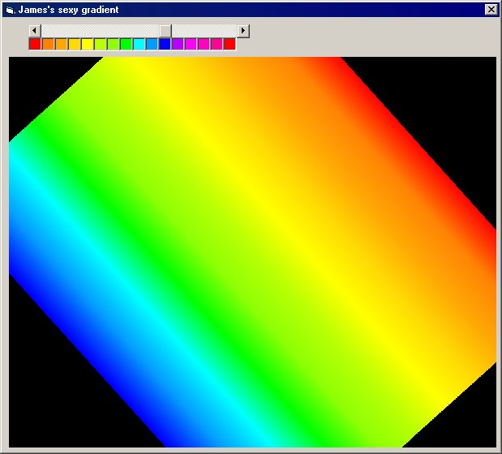



## \_\_\_\_\_\_Rotating Gradient\_\_\_\_\_\_

### Description

The kewlest gradient ever shown in an easy way, it allows u to draw a gradient filled picture box at any angle simply click and drag the picture box and up to 15 colors can be added through the blend aswell!!! (can be modified for more)

hope u like, please vote!!!
 
### More Info
 

             |
---                |---
**Submitted On**   |2002-04-13 20:14:42
**By**             |[Agent Smith](https://github.com/Planet-Source-Code/PSCIndex/blob/master/ByAuthor/agent-smith.md)
**Level**          |Advanced
**User Rating**    |4.7 (14 globes from 3 users)
**Compatibility**  |VB 5\.0, VB 6\.0, VB Script, ASP \(Active Server Pages\) , VBA MS Access, VBA MS Excel
**Category**       |[Graphics](https://github.com/Planet-Source-Code/PSCIndex/blob/master/ByCategory/graphics__1-46.md)
**World**          |[Visual Basic](https://github.com/Planet-Source-Code/PSCIndex/blob/master/ByWorld/visual-basic.md)
**Archive File**   |[Rotating\_G717084132002\.zip](https://github.com/Planet-Source-Code/agent-smith-rotating-gradient__1-33776/archive/master.zip)

